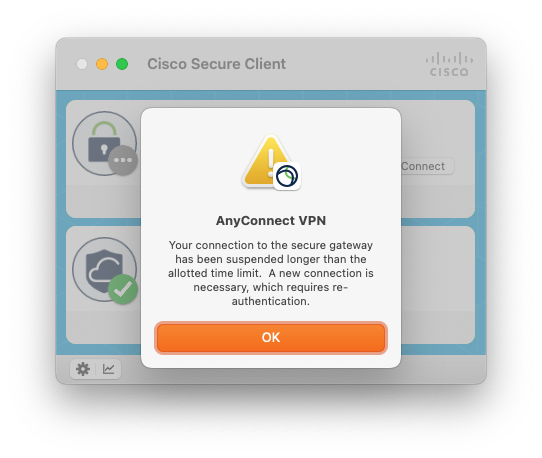

# Cisco Reconnect

A Mac LaunchAgent to automatically reconnect
[Cisco Secure Client](https://www.cisco.com/site/us/en/products/security/secure-client/index.html)
whenever it disconnects and won't automatically reconnect itself (typically after a long sleep).

Simply checkout the repo, put it somewhere, and run `install.sh` to set it up.\
You may get some one-time popups about Applescript or Accessibility or System Events, which you'll need to allow.

Note that it will check if it needs to reconnect every 10 seconds, so you cannot actually stay disconnected from
the VPN while this is running unless you actually quit Cisco Secure Client.

If it doesn't seem to be working, try checking the logs at 
`~/Library/Logs/cisco-reconnect/stderr.log` and `~/Library/Logs/cisco-reconnect/stdout.log`

You can run `uninstall.sh` to remove it.
