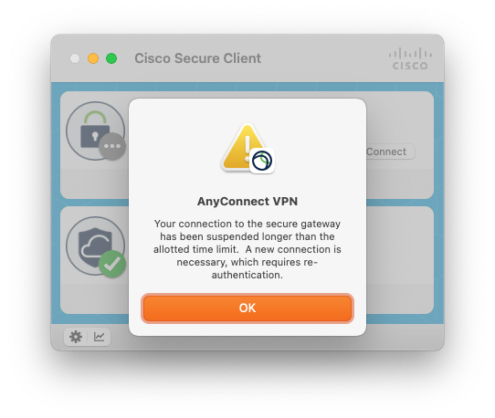
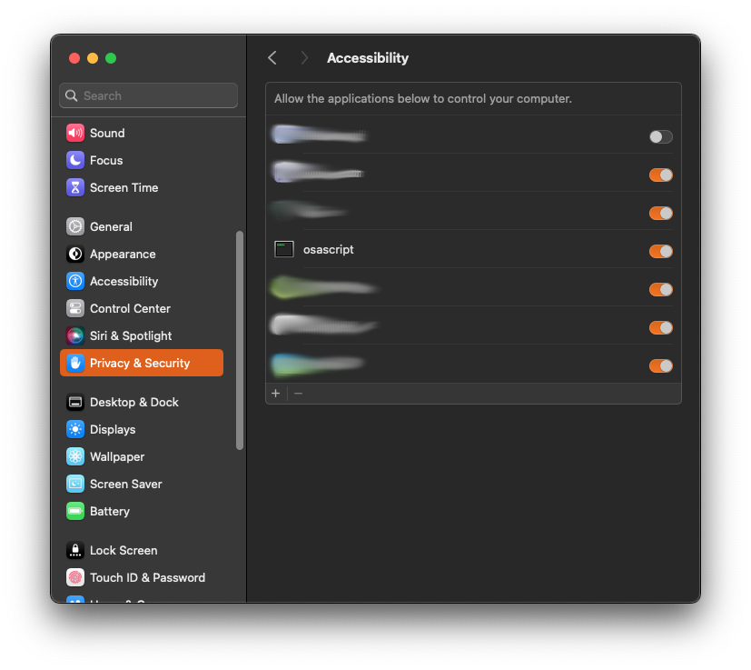

# Cisco Reconnect

A Mac LaunchAgent to automatically reconnect
[Cisco Secure Client](https://www.cisco.com/site/us/en/products/security/secure-client/index.html)
whenever it disconnects and won't automatically reconnect itself (typically after a long sleep).  In
particular, this:

<!-- TOC -->
* [Cisco Reconnect](#cisco-reconnect)
  * [Install](#install)
  * [Details](#details)
  * [Troubleshooting](#troubleshooting)
  * [Uninstall](#uninstall)
<!-- TOC -->

## Install

1. Open System Preferences and go to "Privacy & Security" and then "Accessibility".
1. Click the "+" button in the bottom left, navigate to `/usr/bin/`, and add `osascript`; making 
   sure that it's slider is enabled (see screenshot below).
1. Checkout this repo somewhere that you want to keep it.
1. Run `install.sh`.

## Details

Basically, this is an Applescript that checks every 10 seconds if the Cisco Secure Client is
connected, and if not, click the "Connect" button - all via the UI because the Cisco Secure Client
is not scriptable.  Note that because we're checking every 10 seconds, you cannot realistically stay
disconnected from the VPN while this is running unless you actually quit Cisco Secure Client.

`osascript` is the shell to run Applescripts (see [here](https://ss64.com/mac/osascript.html)
for more details), hence why it needs to be allowed in the System Preferences.

## Troubleshooting

If it doesn't seem to be working, try checking the logs at 
`~/Library/Logs/cisco-reconnect/stderr.log` and `~/Library/Logs/cisco-reconnect/stdout.log` for 
any details.

## Uninstall

1. Run `uninstall.sh`.
1. (Optional) Remove `osascript` from the "Accessibility" System Preferences.
